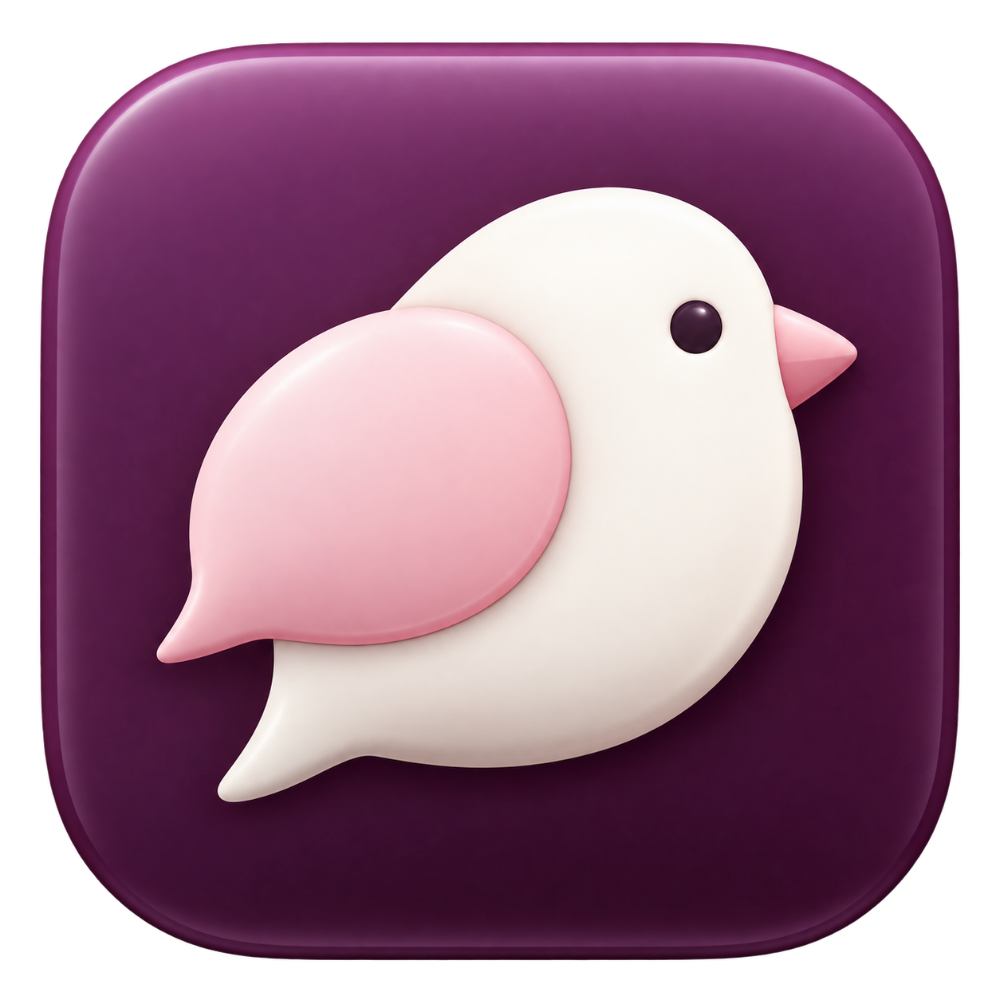

# Chirpberry

An original, open-source notebook for multilingual meetings. Electron is the approved desktop direction; the SwiftUI Mac app remains preserved during migration.



**Electron 0.2.0-preview.1 is available as an experimental Mac preview.** [Download the DMG and source](https://github.com/rirachii/chirpberry/releases/tag/v0.2.0-preview.1) or follow the [quick-start guide](https://chirpberry.vercel.app/get-started). Requires Apple Silicon and macOS 26+. The app is ad-hoc signed and **not notarized**; macOS may block its first launch. Live provider/device and sustained-meeting performance acceptance remain incomplete. See [publication evidence and limits](docs/preview-distribution.md).

```sh
brew install --cask rirachii/tap/chirpberry
```

Homebrew uses `/Applications/Chirpberry Electron Candidate/Chirpberry.app`. Preserve the native app and never replace or force-install over a running candidate.

## Try the Electron candidate

Requires Node.js 22.12+ and npm. Mac capture requires Apple Silicon, macOS 26+, Xcode command-line tools, and Swift. Windows/Linux builds use Electron capture; their actual device acceptance remains pending.

```sh
git clone https://github.com/rirachii/chirpberry.git
cd chirpberry
npm ci --prefix desktop
npm start --prefix desktop
```

The four-step first-run guide introduces notes, optional Valsea setup, Apple Calendar and call suggestions, then a first note. **Set up later** opens the notebook without an account. Settings → **Quick start guide** reopens it. Setup never starts recording.

For speech, save your own Valsea API key in Settings, review and accept the cloud-processing disclosure, then explicitly start recording or dictation. Inform participants and respond to the OS permissions for the features you choose. Optional meeting questions and response drafts need a separate OpenAI API key and disclosure. Provider accounts and usage costs are separate from the app's free software license.

See [desktop setup, packaging, storage, and platform limits](desktop/README.md).

## Implemented in Electron

- Local meeting notes and Scratchpads, search, notebooks, pinning, reversible Trash, and atomic persistence.
- A 200-point floating capture bar, microphone dictation to clipboard, and opt-in global shortcuts, including Fn/Globe on Mac with Accessibility access.
- Valsea live transcription, optional translation and speaker separation, independent generated summaries, and explicit audio-file import. Only final transcript events are saved; original notes stay separate.
- Upcoming meetings from accounts already in macOS Calendar, optional reminders, and local possible-call suggestions. Calendar and detection are optional and never start recording automatically. Browser activity cannot identify Google Meet specifically.
- Meeting questions, catch-up, suggested questions, and editable response drafts through OpenAI, with source excerpts and independent cancellation.
- Reviewed clipboard/Markdown sharing, with personal notes and transcripts opt-in. JSON/text import creates copies; exports and a read-only MCP helper support local workflows.

There is no direct Google/Microsoft sign-in, hosted sharing, automatic attendee messaging, external-editor insertion, or automatic updater. Windows loopback needs device acceptance; Linux capture is microphone-only. Calendar and call suggestions currently require Mac.

Chirpberry is independent and is not affiliated with Granola, Wispr, or Valsea. References inform general interaction patterns; branding, copy, composition, and source are original.

## Privacy and storage

The Electron notebook uses `Chirpberry Desktop/Meetings` in the OS application-data directory. It does not open or migrate the native `Chirpberry/Meetings` store automatically. Import copies documents with new identities.

Live audio is not saved to disk by default. Explicit speech actions send audio to Valsea; summaries send the selected notes and transcript. Optional meeting questions send bounded excerpts to OpenAI. Credentials stay in protected OS storage and never reach notebook renderers or exports. Startup checks key presence without reading secret data. There is no Chirpberry backend, automatic cloud synchronization, analytics, or outbound messaging.

Connecting an AI client through MCP grants that client read-only access to local meeting content; the client's processing policies then apply. See [MCP configuration](desktop/README.md#implemented-behavior).

## Development and release

```sh
npm ci --prefix site
npm ci --prefix desktop
scripts/verify.sh
npm run test:e2e --prefix desktop
npm run package:installers --prefix desktop
```

The full verification script also requires Xcode and XcodeGen for the preserved native app. Installer packaging is unpublished by default. Mac artifacts are ad-hoc signed and **not notarized**; Windows installers are unsigned. Automated tests do not establish live provider success, OS consent, physical shortcuts, clean installation, or sustained real-meeting performance. Follow the [release procedure](docs/releasing.md) before publishing.

The `site/` directory is a preserved native marketing draft. The current public website has a separate source checkout and deployment; see [website ownership](docs/releasing.md#public-website).

## Preserved SwiftUI app

The native app in `macOS/` targets Apple Silicon and macOS 26. It includes native menus, the companion, Valsea speech, and optional Apple Intelligence answers when available. Its source, store, build, and acceptance remain distinct from Electron.

```sh
brew install xcodegen
scripts/build.sh
open dist-native/Chirpberry.app
```

Do not replace an existing native app or point Electron at its document store during candidate acceptance. See the [native companion contract](docs/desktop-companion.md).

Read [architecture](docs/architecture.md), [product plan](docs/plan.md), [design contract](DESIGN.md), and [verification history](docs/verification.md). Contributions are welcome under the [MIT license](LICENSE).
